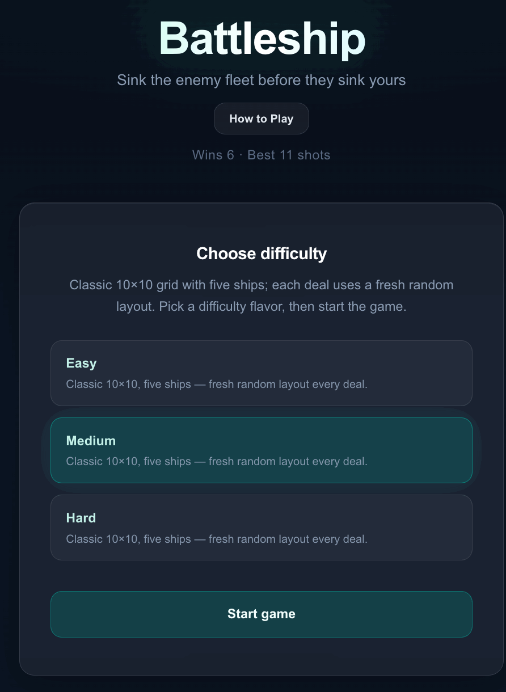
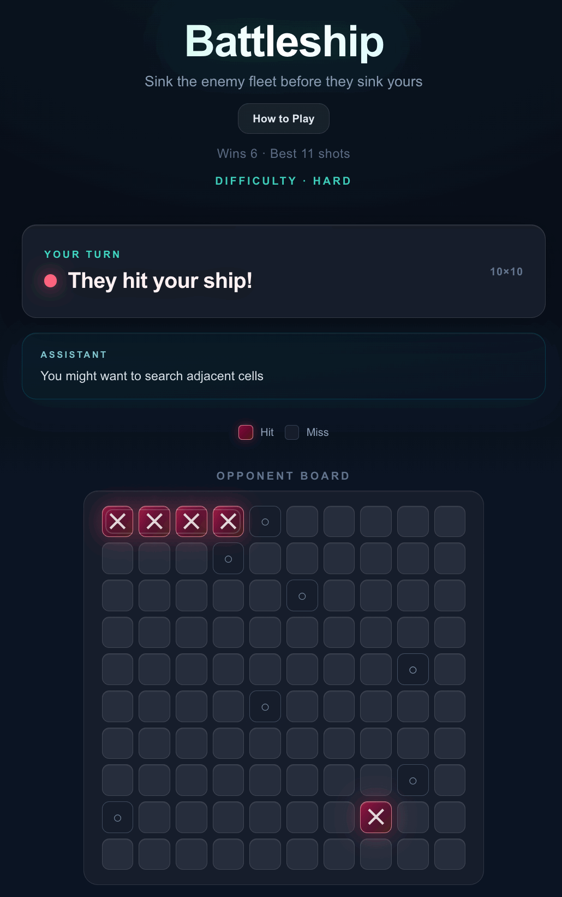
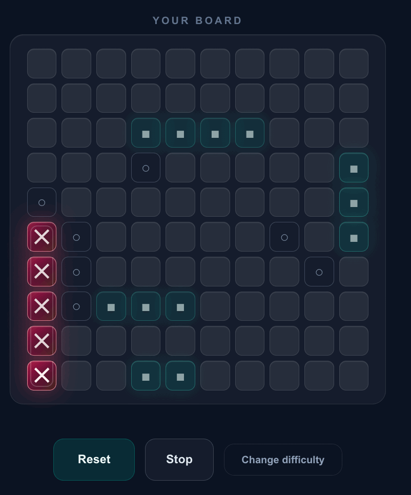

# Battleship: Solo Tactical
# AI Battleship Game

  <strong>A modern implementation of Battleship with a state-driven architecture and heuristic AI opponent.</strong>

  

  Turn-based gameplay · Dual-board system · Heuristic AI · Unit-tested core logic

## Screenshots

<table>
  <tr>
      <td align="center">
       
      AI Turn
    </td>
    <td align="center">
       
      Player Board
    </td>
  </tr>
</table>

---

## Overview

This application implements a complete Battleship experience with both player and AI-controlled gameplay. The system is designed around clear state transitions and deterministic game logic, ensuring predictable and maintainable behavior.

Key capabilities include:
- Full game loop: setup → turn-based gameplay → game over
- Dual-board system separating player and opponent state
- Classic 10×10 grid with standard ship configuration
- Heuristic AI opponent with adaptive behavior
- Lightweight UI enhancements to improve usability and clarity
- Unit-tested core logic for reliability and correctness

---

## Core Gameplay

- 10×10 grid based on the standard Battleship format
- Five ships per side:
  - Carrier (5)
  - Battleship (4)
  - Cruiser (3)
  - Submarine (3)
  - Destroyer (2)
- Randomized ship placement for both player and AI
- Alternating turn-based gameplay
- Hit and miss tracking on both boards
- Ships track individual damage and are considered sunk when all positions are hit
- Game ends when all ships in a fleet are destroyed

Unlike a basic implementation, this project introduces structured AI behavior with multiple difficulty levels and a modular game engine.

---

## Features

### Core Gameplay
- Manual ship placement with validation
- Turn-based player vs AI gameplay
- Hit, miss, and sunk detection
- Visual feedback for shots and ship states

### Difficulty System (Fully Implemented)

Difficulty is not cosmetic — it directly impacts AI behavior:

- **Easy**
  - Fully random targeting
  - No memory of previous hits
  - No targeting strategy

- **Medium**
  - Random search phase
  - Targets adjacent cells after a hit
  - Basic state awareness

- **Hard**
  - Hunt + target strategy
  - Tracks ship orientation after multiple hits
  - Prioritizes optimal targeting paths

This system is implemented by threading difficulty through AI decision functions and modifying behavior without duplicating core logic.

---

## System Design

The system is built around a state-driven architecture:

setup → playerTurn → aiTurn → gameOver

Key design elements:
- Separation of concerns between player and AI boards
- Independent tracking of player and AI ship states
- Centralized game state management
- Deterministic win condition based on fleet destruction
- Turn orchestration ensuring strict alternation between player and AI

---

## Testing

Core game logic is covered by unit tests to ensure correctness and stability.

Tested areas include:
- Ship placement validation (bounds and overlap)
- Attack resolution (hit, miss, ship damage tracking)
- Win condition detection
- AI decision constraints (no duplicate moves, valid targeting)

Run tests:

`npm test`

---

## User Experience

The interface focuses on clarity and responsiveness without over-engineering:

- Visual distinction between player and opponent boards
- Turn indicators ("Your Turn" and "AI Thinking")
- Modal with gameplay instructions
- Hit and miss feedback with visual indicators
- Subtle visual enhancements (e.g., board tilt) to improve perceived quality
- Scaled grid layout to support 10×10 gameplay without clutter

---

## Tech Stack

- Frontend: React (or equivalent framework)
- Language: TypeScript / JavaScript
- Styling: CSS
- AI Logic: Custom heuristic implementation (no external libraries)

---

## Getting Started

Install dependencies:

`npm install`

Run the development server:

`npm run dev`

Open in your browser:

`http://localhost (port will auto set)`

---

## Key Learnings

- Designing state-driven systems for interactive applications
- Implementing AI behavior using simple, explainable heuristics
- Managing synchronized state across dual game boards
- Structuring applications to balance clarity, extensibility, and simplicity
- Writing unit tests to validate core system behavior
- Using AI-assisted development tools (e.g., Cursor) effectively for iterative building

---

## Future Improvements

- Multiplayer support (real-time or asynchronous)
- Persistent leaderboard and player statistics
- Configurable difficulty levels with more advanced AI strategies
- Enhanced audio and animation feedback
- Mobile responsiveness and touch optimization
